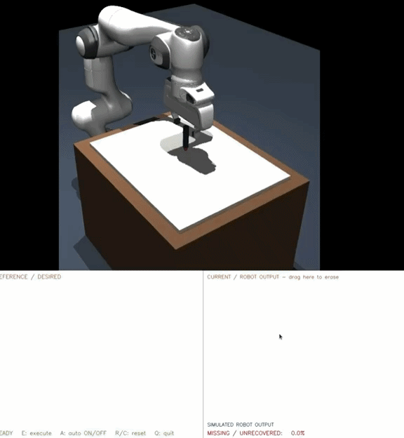

# Robot Drawing Repair

An incremental MuJoCo project for closed-loop robotic drawing correction.
The current milestone provides a mechanically inspectable Franka Panda, manual
mouse drawing, live missing-region detection, and autonomous repair/replanning.

See [`docs/AUTONOMOUS_REPAIR.md`](docs/AUTONOMOUS_REPAIR.md) for the complete
technical explanation of detection, repair planning, execution, and replanning.

## Demo



The Panda executes the reference strokes on the simulated canvas. Erasing part of
the robot output raises the `MISSING / UNRECOVERED` percentage, and auto-repair
replans and redraws only the damaged runs until the metric returns to zero.

## Current structure

```text
robot-drawing-repair/
├── pyproject.toml
├── docs/
│   ├── AUTONOMOUS_REPAIR.md
│   └── media/
│       └── autonomous-repair-demo.gif
├── src/robot_drawing_repair/
│   ├── scene.py       # Panda + marker + canvas model construction
│   ├── drawing_input.py # ordered OpenCV stroke capture
│   ├── image_import.py # binary line-art normalization and stroke extraction
│   ├── error_detection.py # desired/current comparison and error map
│   ├── kinematics.py  # marker-tip inverse kinematics
│   ├── manual.py      # mouse trajectory planning and execution
│   └── viewer.py      # mechanical inspection viewer
└── third_party/
    └── mujoco_menagerie/
        └── franka_emika_panda/
```

The official Menagerie model is kept unchanged. MuJoCo's `MjSpec` API adds the
project-owned marker and workspace directly to the loaded Panda model.

## Environment and installation

This machine currently exposes Python 3.8 as `python3`, so create a Python 3.11
environment explicitly. With Conda:

```bash
conda create -n robot-drawing-repair python=3.11 -y
conda activate robot-drawing-repair
python -m pip install --upgrade pip
python -m pip install -e .
```

SciPy is reserved for later analysis work. Install it only when needed with:

```bash
python -m pip install -e '.[analysis]'
```

If the Menagerie checkout is missing, recreate the small sparse checkout:

```bash
git clone --depth 1 --filter=blob:none --no-checkout \
  https://github.com/google-deepmind/mujoco_menagerie.git \
  third_party/mujoco_menagerie
git -C third_party/mujoco_menagerie sparse-checkout init --cone
git -C third_party/mujoco_menagerie sparse-checkout set \
  franka_emika_panda LICENSE README.md
git -C third_party/mujoco_menagerie checkout
```

## Run manual mode

```bash
conda activate robot-drawing-repair
cd /path/to/robot-drawing-repair
python -m robot_drawing_repair.manual
```

The OpenCV window contains two side-by-side canvases:

- **REFERENCE / DESIRED** on the left records the ordered mouse trajectory.
- **CURRENT / ROBOT OUTPUT** on the right is reconstructed from simulated
  marker motion.

Controls:

- Hold the left mouse button on the left canvas to draw the reference.
- Press `I` to select a binary or line-art image and convert it into drawable
  reference strokes. Importing replaces and resets the current drawing.
- Drag on the right canvas to erase part of the current robot output. Matching
  ink segments are also removed from the MuJoCo canvas view.
- Press `A` to enable persistent auto-repair mode. While enabled, each completed
  erase gesture starts a two-second countdown and is then repaired automatically.
  Press `A` again to disable the mode.
- Release and drag again to create a disconnected stroke.
- Press `R` or `C` to reset both canvases and return the Panda home. Reset also
  cancels an execution currently in progress.
- Press `E` to execute the captured strokes.
- Press `Q` or Escape to cancel.

An image can also be loaded directly from the command line:

```bash
python -m robot_drawing_repair.manual --image /path/to/line-art.png
```

The importer thresholds dark ink, preserves aspect ratio, fits it within the
reachable canvas margin, thins it to centerlines, and creates one continuous
covering walk per connected ink component. At branches the walk may retrace
existing black ink to avoid unnecessary marker lifts. Detailed artwork can
still require many robot waypoints and will take substantially longer to plan
and execute than a simple handwritten shape.

The OpenCV input and MuJoCo viewer remain open while the Panda executes and
updates the right canvas in real time.

The current panel reports `MISSING / UNRECOVERED`
as a percentage of desired path samples. Missing desired regions are marked with
sparse red dots.
Matching is directional: it permits normal sideways robot tracking offset but
only a small offset along the stroke. Therefore ink at the two ends of a gap
cannot falsely cover the empty middle. Its Boolean `error_map` is kept separate
from the display overlay for use by the repair planner.

## Autonomous repair

Enable auto-repair with `A`, then erase simulated ink. After the two-second
countdown, the repair planner:

1. Extracts missing runs from the original ordered mouse strokes.
2. Adds a small overlap with intact ink for clean reconnection.
3. Draws through short healthy bridges when that is faster than lifting,
   travelling in air, and lowering the marker again.
4. Selects the nearest remaining repair endpoint, reversing a run when that
   shortens marker-up travel.
5. Displays the planned repair as yellow lines and square waypoint boxes.
6. Executes the planned repair and checks the result again.

If the right canvas is erased during repair, the current plan is cancelled at
the robot's present pose. Once the mouse button is released, the detector updates
the error map and builds a new shortest-first plan that includes the new damage.
The cycle finishes when no missing trajectory runs remain. If a repair attempt
makes less than `0.05%` measurable improvement, it stops and explicitly reports
the remaining damage as unresolved instead of falsely declaring success or
looping through no-op arm movements. The simulation retains ink geometry as a
segment list so it can render visible ink into both the viewer and RGB sensor.
That list defines the simulated physical scene, but it is not passed to error
detection; autonomous state is updated only from rendered RGB pixels.

The complete input window maps into the central 28 x 24 cm of the physical
canvas. This conservative initial drawing region has been checked at its four
corners. It can be expanded later alongside collision-aware reachability tests.

## Run mechanical inspection

From the project root, with the environment activated:

```bash
python -m robot_drawing_repair
```

The installed equivalents are `robot-drawing-repair-manual` and `robot-drawing-repair-inspect`.

## First visual inspection

The initial pose is Menagerie's controlled `home` keyframe. In the viewer check:

- The Panda base is upright on the floor and no links intersect the table.
- The white canvas is 50 cm by 40 cm, centered 55 cm in front of the base.
- The dark marker is rigidly attached along the gripper's local tool axis.
- The red marker-tip site is beyond the fingers; the blue site marks canvas center.
- The canvas lies inside the arm's practical workspace, with room around its edges.
- Nothing vibrates, falls, explodes, or begins in obvious collision.
- Orbit and zoom the camera to judge scale and tool direction from several angles.

The home pose is intentionally an inspection pose, not a drawing/contact pose.
The marker tip need not touch the canvas yet. A later inverse-kinematics milestone
will validate exact contact pose, orientation, and edge reachability.
